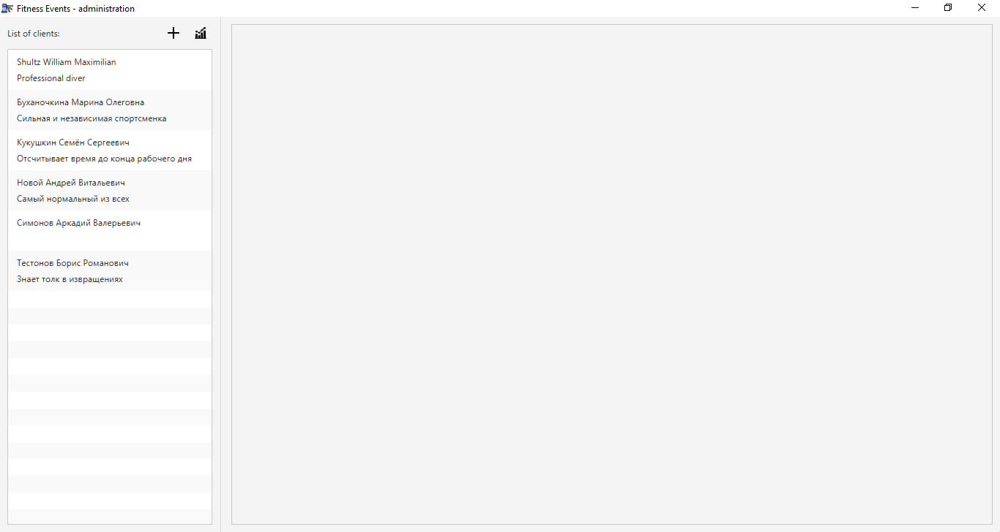
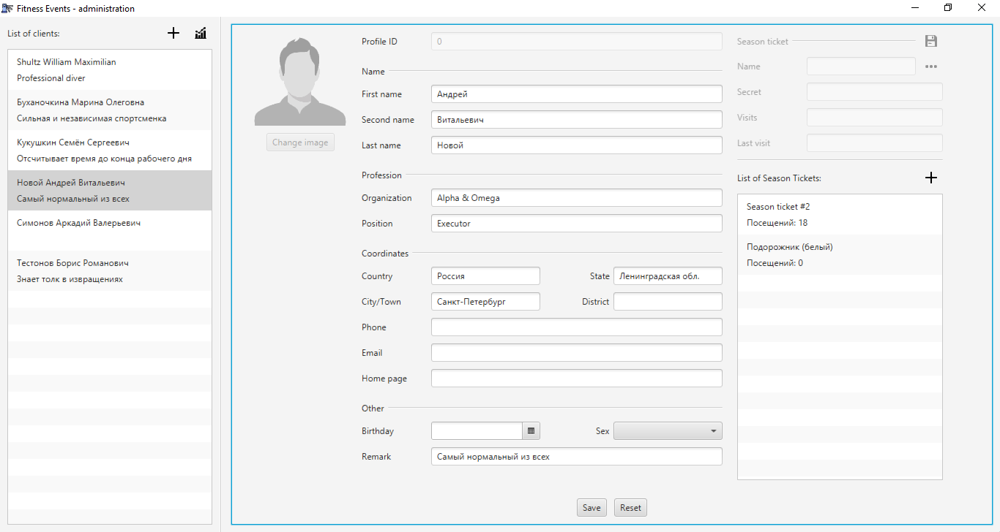
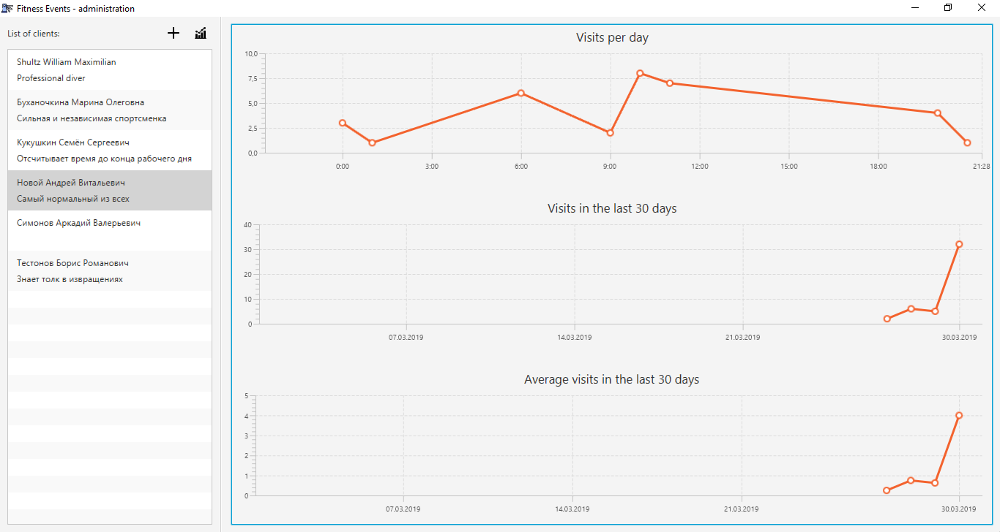

### Main concept

This application is built on idea of **event sourcing**: objects stored in DB in sequence of changes of basic unit.

For example, imagine that we want to store credits of one man (Name, Last name, Home phone, Work phone, ...).
We can easily kepp this object in relative model:

```haskell
{
    name       :: varchar (64),
    last_name  :: varchar (128),
    phone_home :: varchar (12),
    phone_work :: varchar (12)
}
```

There are some problems: in case of big number of variative parameters (fields), and changing set of these parameters.
So the solution is to save this object as sequence of events:

```haskell
create client #1
set client #1 name ...
set client #1 last_name ...
set client #1 phone_home ...
```

In this case the set of fields is not restricted at all (unbounded). 
And the final object can be fetched by incremental application of such events 
to the previous instance (in this case empty object on new client).

### Administration & statistics application

Application has 2 modules: that is available from _home_ window

Left side of appliaction contains list view with all clients that is registerd in system. 
Click on item of this list will open client details in the right part.
Also click on `+` sign on top will cause the same action, but in details will be empty fields.



Client details scene contains 3 columns: profile avatar, personal data, season tickets.
The first colum is not implemented yet (so it's disabled). 
The second column is full different text fields with personal information about client.
When creates client all this fields is empty, and just _name_ and _last name_ is required.
If data is modified it should be saved with `save` button (even during creating new instance).
And the third column contains all information about season tickets that belongs to current client.
On top there are fields for modification data of season ticket (after click on list item) and
the list of tickets (with the same behavior aslist of clients).
And also after modification icon with `floppy disk` should be clicked.



Statistics scene displays in real time changes of measured parameters such as _day visits_,
_month visits_ and avarage number of visits in day among all clients in system.
List of clients still being available for the fast access to client datails.


### Turnstile (android emulator)

To make our project so close to reality we decided to write application that will emulate behavior of turnstile.
For some reasons this appliaction is available only for android platform, and devices which supports **NFC**.

| Activity in wait mode | On allowed access | On denied access|
|-----------------------|-------------------|-----------------|
||||

<br />


#### Thanks for interes to this project. We did our best!
> We also will be grateful for the star ;)

[](https://sourcerer.io/fame/Shemplo/Shemplo/Fitness-Center-Software/links/0)[](https://sourcerer.io/fame/Shemplo/Shemplo/Fitness-Center-Software/links/1)[](https://sourcerer.io/fame/Shemplo/Shemplo/Fitness-Center-Software/links/2)[](https://sourcerer.io/fame/Shemplo/Shemplo/Fitness-Center-Software/links/3)[](https://sourcerer.io/fame/Shemplo/Shemplo/Fitness-Center-Software/links/4)[](https://sourcerer.io/fame/Shemplo/Shemplo/Fitness-Center-Software/links/5)[](https://sourcerer.io/fame/Shemplo/Shemplo/Fitness-Center-Software/links/6)[](https://sourcerer.io/fame/Shemplo/Shemplo/Fitness-Center-Software/links/7)
